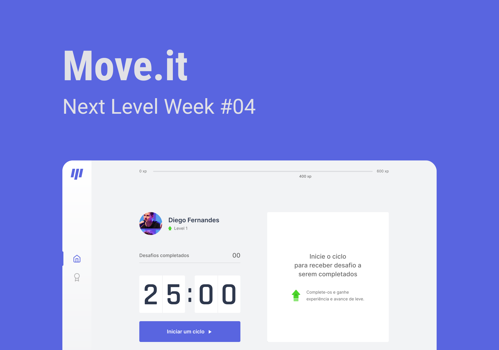
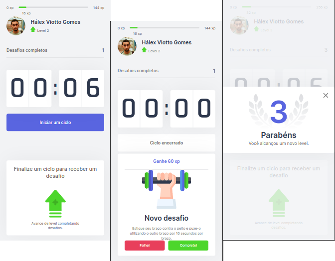

<h1 id="move-it">Move.it</h1>
<p>
An app developed during the Next Level Week 4 event by Rocketseat. This app help people to exercise during their long period of work in front of a computer.
</p>

<p>
Based on Pomodoro technique, the user start the countdown, works focused on the tasks and when the timer is out, the user do the exercise shown to it. After the user did the exercise, starts a new Pomodoro cycle, activating the countdown again.
</p>

<p>
The user gain experience and levels completing the exercises.
</p>

# Table of contents

<!--ts-->

- [Move.it](#move-it)
- [Table of contents](#table-of-contents)
- [Project status](#project-status)
  - [Features](#features)
- [Screenshots](#screenshots)
- [Requirements and how to run this app](#requirements-and-how-to-run-this-app)
- [Technologies used in this project](#technologies-used-in-this-project)
- [Author](#author)

<!--te-->

# Project status

🚧 Under construction 🚧

### Features

- [x] Timer, challenges and level up system
- [x] Responsive layout
- [ ] Dark mode theme
- [ ] Login with Github (OAuth)
- [ ] Ranking system
- [ ] Sharing level up to Twitter
- [ ] PWA

# Screenshots

- Default screen (web)


- Time out and challenge (web)


- User leveling up (web)


- Mobile responsive (web)



# Requirements and how to run this app

You will need to have installed on your machine:

- [Git](https://git-scm.com/)
- [Node.js](https://nodejs.org/en/)
- [Visual Studio Code](https://code.visualstudio.com/) (optional)
- [Yarn](https://yarnpkg.com/) (optional)

To run this app:

```
# Open your terminal and:

# Clone this repository to your machine

$ git clone https://github.com/HalexV/nlw4-moveit-nextjs-app.git

# Enter into the project directory

$ cd project-directory

# Run the command to install the dependencies of the project

$ yarn install or $ npm install

# Run the command to run the project in development (dev) mode

$ yarn dev or $ npm run dev

# Open your browser and access the app

Access http://localhost:3000 on your browser

```

# Technologies used in this project

- [Node.js](https://nodejs.org/en/)
- [React](https://reactjs.org/)
- [TypeScript](https://www.typescriptlang.org/)

# Author

<div>
  
  <p>Hálex Viotto Gomes</p>
</div>

<div>
  <a href="https://github.com/HalexV">
    
  </a>

  <a href="https://www.linkedin.com/in/h%C3%A1lex-viotto-gomes-5375771a0/">
    
  </a>

  <a href="https://app.rocketseat.com.br/me/halex-viotto-gomes-1594515532">
    
  </a>
</div>
